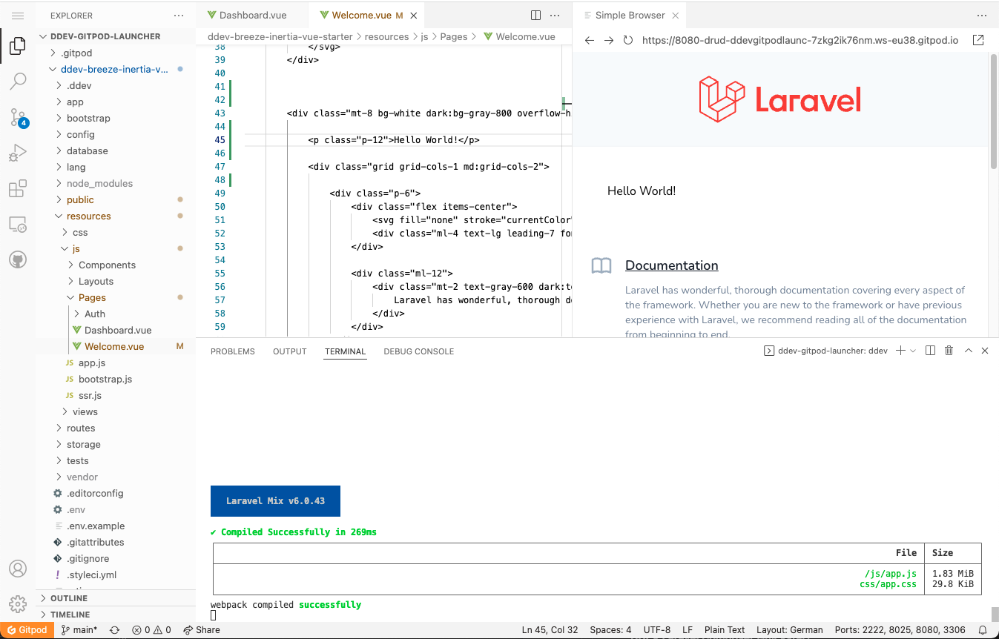
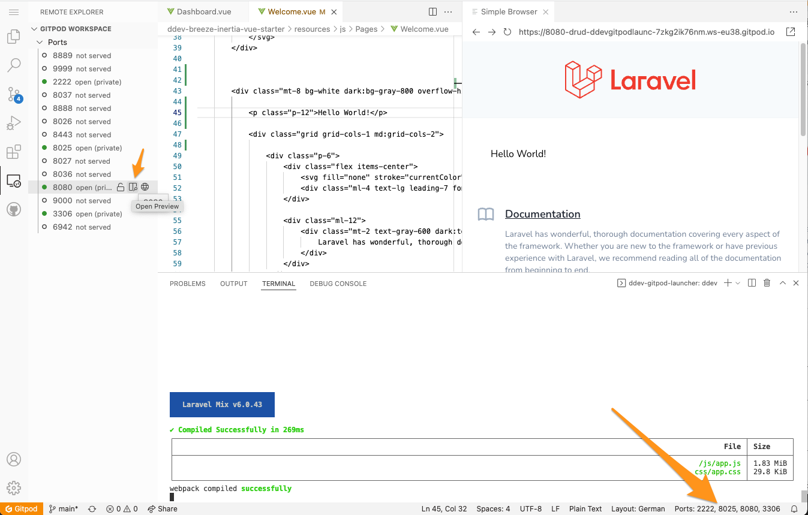

# ddev-breeze-inertia-vue-starter

Simple demo installation to play around with [InertiaJS](https://inertiajs.com/) and [Laravel Breeze](https://laravel.com/docs/9.x/starter-kits#breeze-and-inertia). It was created with help of the open source tool [DDEV](https://ddev.readthedocs.io/en/stable/) for standardized PHP environments. It runs in your browser as well as on your local machine (via DDEV-local). 

Just click the "Open in Gitpod" below to play with this starter in your browser! 🚀

**[🎥 &nbsp;Watch screencast](https://www.youtube.com/watch?v=XDn_itJ0s64)**

## 1. Launch it in your browser via Gitpod

Just click this button and follow the steps below:

[](https://gitpod.io/#DDEV_REPO=https%3A%2F%2Fgithub.com%2Fmandrasch%2Fddev-breeze-inertia-vue-starter,DDEV_ARTIFACTS=/https://github.com/drud/ddev-gitpod-launcher/) 

Run these steps in the Gitpod terminal to create the initial config, e.g. connect to the database provided by DDEV:

```bash
cd ddev-breeze-inertia-vue-starter/ && \
    ddev start && \
    ddev composer install && \
    ddev exec "cat .env.example | sed  -E 's/DB_(HOST|DATABASE|USERNAME|PASSWORD)=(.*)/DB_\1=db/g' > .env" && \
    ddev artisan key:generate && \
    ddev artisan migrate && \
    ddev exec npm install && \
    ddev exec npm run dev && \
    gp preview $(gp url 8080)
```

Nice, your project should now be ready! 🥳



Start exploring by modifying the file 
`ddev-breeze-inertia-vue-starter/resources/js/Pages/Welcome.vue`. If you change something, you need to run `ddev exec npm run dev` again and reload the browser window inside Gitpod.

You can run `ddev exec npm run watch` as well to watch automatically for changes.

## Troubleshooting

**You don't see the Simple Browser?**

Your project runs on port 8080, your project runs on port 8080. To view it in the Gitpod Simple Browser you can run `gp preview $(gp url 8080)`. You can click on the "Ports" menu in the gitpod taskbar as well to figure out the url and open the site in gitpods Simple Browser (or in another browser tab):



## 2. Use it on... on your local workspace:

- Pull this repository
- Install DDEV if you haven't, e.g. `brew install drud/ddev/ddev`, see [docs](https://ddev.readthedocs.io/en/stable/#installation)
- Run these initial steps (only needed for first time):

```bash
ddev start
ddev composer install
ddev exec "cat .env.example | sed  -E 's/DB_(HOST|DATABASE|USERNAME|PASSWORD)=(.*)/DB_\1=db/g' > .env"
ddev artisan key:generate
ddev artisan migrate
ddev exec npm install
ddev exec npm run dev
```

Run `ddev launch` to open your new site. 

You can run `ddev exec npm run watch` to watch automatically for changes. Start exploring by modifying the file `ddev-breeze-inertia-vue-starter/resources/js/Pages/Welcome.vue` for example.

<hr>

## 3. How was this created?

This repository was simply created by following the [DDEV Laravel Composer Quickstart](https://ddev.readthedocs.io/en/stable/users/cli-usage/#laravel-composer-setup-example) and adapting the [Laravel Breeze Inertia Vue](https://laravel.com/docs/9.x/starter-kits#breeze-and-inertia) install commands for DDEV usage. The gitpod integration was made possible via [Gitpod DDEV launcher](https://drud.github.io/ddev-gitpod-launcher/) by [rfay](https://github.com/rfay). 

**DDEV Laravel Composer Quickstart**

```
mkdir my-laravel-app
cd my-laravel-app
ddev config --project-type=laravel --docroot=public --create-docroot
ddev start
ddev composer create --prefer-dist laravel/laravel
ddev exec "cat .env.example | sed  -E 's/DB_(HOST|DATABASE|USERNAME|PASSWORD)=(.*)/DB_\1=db/g' > .env"
ddev exec "php artisan key:generate"
```

See: https://ddev.readthedocs.io/en/stable/users/cli-usage/#laravel-composer-setup-example

**Breeze & Inertia (& vue ssr), modified for DDEV:**

```
ddev composer require laravel/breeze --dev
ddev artisan breeze:install vue --ssr
ddev npm install
ddev npm run dev
ddev artisan migrate
ddev launch
```

See: https://laravel.com/docs/9.x/starter-kits#breeze-and-inertia

**GitPod Button**

Created via [ddev-gitpod-launcher](https://gitpod.io/#DDEV_REPO=https%3A%2F%2Fgithub.com%2Fmandrasch%2Fddev-breeze-inertia-vue-starter,DDEV_ARTIFACTS=https%3A%2F%2Fgithub.com%2Fdrud%2Fd9simple-artifacts/https://github.com/drud/ddev-gitpod-launcher/) by [rfay](https://github.com/rfay). 

## 4.Connect with the DDEV community?

[Join DDEV community discord!](https://discord.gg/hCZFfAMc5k)

## 5. TODOs

- [ ] Figure out if we can use [browsersync](https://laravel-mix.com/docs/6.0/browsersync) in Gitpod to reload the browser automagically.
